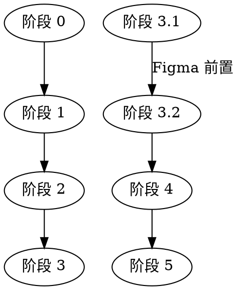

# Daily RSS V2.0.0 实现计划

**创建日期**: 2026-04-11
**版本**: V2.0.0
**状态**: 待审批

---

## 阶段划分

```
阶段 0: 准备与验证 ──→ 阶段 1: JSON 解析框架 ──→ 阶段 2: AI 工作流重构 ──→ 
阶段 3: 邮件模板渲染 ──→ 阶段 4: 测试与优化 ──→ 阶段 5: 部署上线
```

---

## 阶段 0：准备与验证

**目标**: 确认当前代码状态，建立版本基准

### 任务清单

| 任务 | 说明 | 验收标准 |
|------|------|----------|
| 0.1 读取现有代码结构 | 分析 `ai_analyzer.py`, `main.py`, `push_manager.py` | 完成代码地图 |
| 0.2 确认 API 配置 | 验证 `AI_API_KEY`, `AI_API_URL` 配置 | 能成功调用 AI API |
| 0.3 创建 Git 分支 | 从 `v1.0.0` tag 创建 `v2-dev` 分支 | 分支创建成功 |
| 0.4 备份当前数据 | 备份 `data/` 目录中的分析和新闻数据 | 备份完成 |

**预计耗时**: 30 分钟

---

## 阶段 1：JSON 解析框架

**目标**: 实现 JSON 输出和四层降级解析

### 任务清单

| 任务 | 说明 | 验收标准 |
|------|------|----------|
| 1.1 定义 JSON Schema | 在 `config.py` 或独立文件中定义输出结构 | Schema 文件完成 |
| 1.2 实现 `parse_ai_json_response()` | 四层降级解析函数 | 单元测试通过 |
| 1.3 创建空结构生成器 | `get_empty_structure()` 函数 | 能返回完整空结构 |
| 1.4 错误日志记录 | 解析失败时记录详细日志 | 日志包含错误信息 |

### 代码结构

```python
# json_parser.py (新文件)
def parse_ai_json_response(text: str) -> dict:
    """四层降级解析"""
    pass

def get_empty_structure() -> dict:
    """返回空结构"""
    pass

# config.py (新增)
V2_OUTPUT_SCHEMA = {
    "summary": {...},
    "key_news_brief": [...],
    ...
}
```

**预计耗时**: 2 小时

---

## 阶段 2：AI 工作流重构（核心）

**目标**: 实现四层分析流程

### 阶段 2.1：阶段 1 - 概要生成

| 任务 | 说明 | 验收标准 |
|------|------|----------|
| 2.1.1 设计 Prompt | 编写阶段 1 的 AI 提示词 | Prompt 能输出完整 JSON |
| 2.1.2 实现 `generate_summary()` | 调用 AI 生成概要 | 返回符合 Schema 的 JSON |
| 2.1.3 实现 `select_key_news_list()` | 筛选 5-10 条重点新闻（给阶段 2 用） | 包含标题 + 正文 |
| 2.1.4 实现 `select_key_news_brief()` | 筛选 3 条关键新闻（带标签） | 从预设标签库选择 |
| 2.1.5 实现 `generate_briefing()` | 生成四类新闻简报 | 政治/经济/行业/科技 |

### 阶段 2.2：阶段 2 - 观点生成

| 任务 | 说明 | 验收标准 |
|------|------|----------|
| 2.2.1 设计 Prompt | 编写观点生成的提示词 | 能生成 3 个观点 |
| 2.2.2 实现 `generate_news_summaries()` | 为每条重点新闻生成摘要（100 字） | 摘要简洁准确 |
| 2.2.3 实现 `build_summary_package()` | 汇总摘要形成素材包 | 总长 500-1000 字 |
| 2.2.4 实现 `generate_perspectives()` | 生成 3 个观点框架 | 每个观点有标题 + 核心论点 |
| 2.2.5 实现 `expand_perspective_description()` | 为每个观点生成完整描述 | 200-300 字 |
| 2.2.6 实现 `extract_references()` | 从原始新闻中提取引用 | 包含标题+URL |

### 阶段 2.3：阶段 3 - 深度分析

| 任务 | 说明 | 验收标准 |
|------|------|----------|
| 2.3.1 重构现有代码 | 修改 `ai_analyzer.py` 的第二层分析 | 改为 JSON 输出 |
| 2.3.2 设计 Prompt | 编写 JSON 格式的提示词 | AI 输出 JSON 而非 Markdown |
| 2.3.3 添加标签字段 | 每个分析结果带 1-2 个标签 | 从预设标签库选择 |
| 2.3.4 保持 6 字段结构 | facts/viewpoint/causes/prediction/advice | 结构完整 |

### 阶段 2.4：阶段 4 - 建议生成

| 任务 | 说明 | 验收标准 |
|------|------|----------|
| 2.4.1 设计 Prompt | 编写建议生成的提示词 | 能生成 4 类建议 |
| 2.4.2 实现 `generate_suggestions()` | 调用 AI 生成建议 | 返回 4 个对象 |
| 2.4.3 实现 `format_suggestion()` | 格式化每个建议（标题 + 内容） | 符合 Schema |

### 阶段 2.5：流程整合

| 任务 | 说明 | 验收标准 |
|------|------|----------|
| 2.5.1 实现 `analyze_daily_news_v2()` | 新的主分析入口 | 四个阶段顺序执行 |
| 2.5.2 数据传递机制 | 阶段间正确传递数据 | 数据完整 |
| 2.5.3 错误处理 | 任一阶段失败不影响其他阶段 | 降级策略生效 |
| 2.5.4 日志记录 | 每个阶段记录开始/结束/耗时 | 日志清晰 |

**预计耗时**: 8 小时

---

## 阶段 3：邮件模板渲染

**目标**: 实现 HTML 邮件模板，支持 JSON 数据渲染

### 任务 3.1：Figma 设计稿对接（前置）

| 任务 | 说明 | 验收标准 |
|------|------|----------|
| 3.1.1 获取 Figma API Key | 用户在 Figma 设置中生成 | API Key 可用 |
| 3.1.2 配置 Figma MCP | 使用 `claude mcp add` 命令 | MCP 连接成功 |
| 3.1.3 读取设计稿 | 使用 Figma MCP 获取设计数据 | 获取布局/颜色/字体 |
| 3.1.4 提取 Design Tokens | 转换为 CSS 变量格式 | 变量文件完成 |
| 3.1.5 确认设计细节 | 与用户讨论布局/样式 | 设计方案确认 |

### 任务 3.2：HTML 模板实现

| 任务 | 说明 | 验收标准 |
|------|------|----------|
| 3.2.1 创建模板文件 | `email_template.html` | 模板文件完成 |
| 3.2.2 实现 CSS 变量 | 基于 Design Tokens | `:root { --xxx }` |
| 3.2.3 实现各板块模板 | summary/key_news/perspectives/etc. | 7 个板块完整 |
| 3.2.4 邮件客户端兼容 | 使用 table 布局，内联 CSS | Gmail/Outlook 测试通过 |
| 3.2.5 实现 `render_email()` | JSON → HTML 渲染函数 | 能正确渲染 |

### 任务 3.3：推送模块集成

| 任务 | 说明 | 验收标准 |
|------|------|----------|
| 3.3.1 修改 `push_manager.py` | 支持 V2 输出格式 | 代码更新 |
| 3.3.2 实现 HTML 邮件发送 | 使用新模板发送邮件 | 邮件样式正确 |
| 3.3.3 错误通知 | 发送失败时通知 | 错误邮件发送 |

**预计耗时**: 4 小时（不含 Figma 讨论时间）

---

## 阶段 4：测试与优化

**目标**: 验证功能正确性，优化性能

### 任务清单

| 任务 | 说明 | 验收标准 |
|------|------|----------|
| 4.1 单元测试 | 为每个函数编写测试 | 覆盖率 > 80% |
| 4.2 集成测试 | 完整流程测试 | 4 个阶段都执行 |
| 4.3 性能测试 | 测量总耗时/Token 消耗 | < 5 分钟，< 50k tokens |
| 4.4 容错测试 | 模拟 API 失败/解析失败 | 降级策略生效 |
| 4.5 Prompt 调优 | 优化 AI 输出质量 | 输出稳定符合 Schema |
| 4.6 样式优化 | 根据邮件渲染效果调整 | 视觉效果达标 |

**预计耗时**: 4 小时

---

## 阶段 5：部署上线

**目标**: 正式发布 V2.0.0

### 任务清单

| 任务 | 说明 | 验收标准 |
|------|------|----------|
| 5.1 代码审查 | 检查代码质量/安全性 | 审查通过 |
| 5.2 更新文档 | 更新 README/PRD | 文档完整 |
| 5.3 创建 Git Tag | `git tag v2.0.0` | Tag 创建成功 |
| 5.4 合并到 main 分支 | 合并 `v2-dev` 到 `main` | 合并成功 |
| 5.5 部署到 GitHub Actions | 更新 workflow 配置 | 自动运行成功 |
| 5.6 监控运行 | 观察 1-2 次自动运行 | 无错误 |

**预计耗时**: 2 小时

---

## 任务依赖关系



---

## 关键风险

| 风险 | 影响 | 缓解措施 |
|------|------|----------|
| AI 输出 JSON 不稳定 | 解析失败率高 | 四层降级 + Prompt 调优 |
| Figma MCP 连接失败 | 无法获取设计稿 | 备选方案：手动导出截图 |
| 邮件客户端兼容性 | 样式错乱 | 使用 table 布局 + 内联 CSS |
| Token 超限 | API 调用失败 | 分批处理 + 摘要压缩 |
| 超时问题 | 阶段 2/3 超时 | 增加超时时间 + 重试机制 |

---

## 开发顺序建议

```
Day 1: 阶段 0 → 阶段 1 (JSON 解析框架)
Day 2: 阶段 2.1 → 阶段 2.2 (概要 + 观点生成)
Day 3: 阶段 2.3 → 阶段 2.4 → 阶段 2.5 (深度分析 + 建议 + 整合)
Day 4: 阶段 3.1 (Figma 对接) → 阶段 3.2 (邮件模板)
Day 5: 阶段 4 (测试) → 阶段 5 (部署)
```

---

## 验收标准汇总

| 类别 | 指标 |
|------|------|
| 功能 | 四层分析完整执行，JSON 输出符合 Schema |
| 性能 | 总耗时 < 5 分钟，Token < 50k/次 |
| 稳定性 | 成功率 > 95%，降级策略有效 |
| 兼容性 | Gmail/Outlook/163 邮箱正常显示 |
| 代码 | 单元测试覆盖率 > 80% |

---

**下一步**: 审批通过后，开始执行阶段 0。
